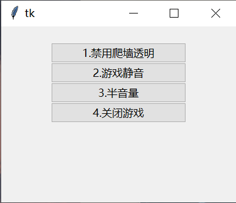

# 原神工具箱  
满足个人需求的小工具：  
1. 本人长期开着原神不关，所以干别的事儿的时候需要快速且方便的给原神静音。我懒得去合成器里单独关闭原神通道
2. 原神关闭需要等半天退到登录界面，还要再等半天才出现退出按钮，极其恶心浪费时间。而且还关不干净，游戏关闭以后启动器还在
3. 爬墙的时候我不想看到一坨空气  
因此就有了这个小工具

## 程序界面

## 使用
[下载](https://github.com/manakanemu/genshintool/releases/)zip后解压，随便放在那里，会根据注册表找原神装在那里了。  
1. 双击“Genshin Toll.exe”打开工具
1. 软件打开时会启动原神
2. 选择“4. 关闭游戏”可以把游戏、工具箱、和原神启动器三者都关了
3. 按钮前面的数字就是该按钮的快捷键
## 卸载
直接删除文件夹就可以，软件不创建任何临时文件，不改动注册表  
## 其他
1. 最近写python比较顺手，就直接用python实现了，打包出来肯定比c和c#写的大，硬伤
2. 随手写的工具，没有美化ui
